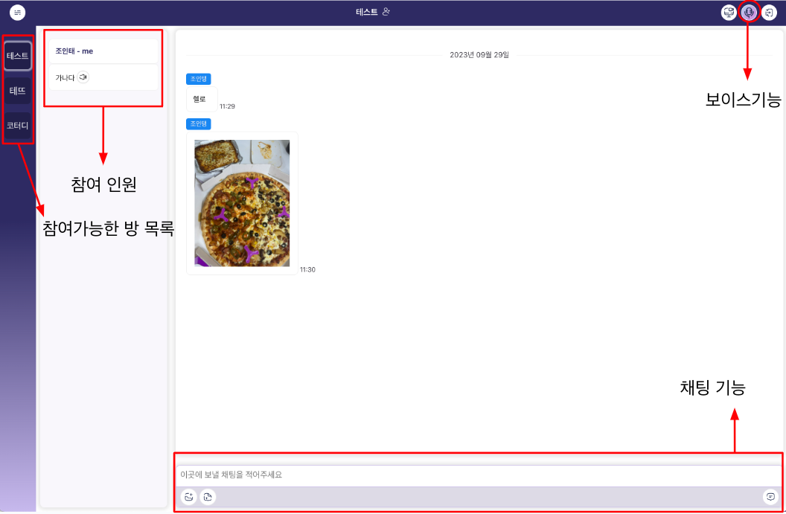
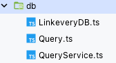

# linkevery

RTC를 이용한 웹 채팅 어플리케이션 [배포 링크](https://jjongtaeng.github.io/linkevery/)

## 기능명세


### 방
- 모든 방은 게스트 형태로 구현(id, pwd같은 인증 없음)
- 좌측에 사이드바에서 방 생성 및 참가
- 방에 참가 시 닉네임을 입력해야함

### 채팅
- 방을 들어가면 바로 방 인원들과 채팅 가능
- 보이스 채팅

### 화면공유
- 보이스 on이 된상태에서 화면 공유 버튼을 누르면 rtc로 화면공유 연결


## 데코레이터를 사용하여 반복적인 이벤트 emit, handler 구조를 공통화
이벤트를 주고 받는 데이터 구조는 category, messageId로 구분하였습니다.
예를들어서

- category - CHAT
- messageId - SEND

로 이벤트를 전송하면 채팅을 수신하는 쪽에선 알맞은 카테고리와 메시지로 이벤트를 핸들링합니다.

핸들링 함수를 아래처럼 ChatPeerHandler를 생성하고, `@peerCategory(CATEGORY.CHAT)`으로 데코레이터로 어떤 `category`에 대한 이벤트 핸들러 클래스인지 명시합니다.
추가적으로 메서드에는 `@peerMessageId(CHAT_MESSAGE_ID.SEND)` 로 어떤 `messageId`로 이벤트를 수신하면 핸들링할 메서드를 정의합니다.

이렇게 각 카테고리별 클래스와 메서드를 생성하여 이벤트를 수신 할 수 있도록 구조화하여 반복적인 코드를 줄이고 보기 좋게 명시할 수 있도록 하였습니다. (spring, nestjs 의 controller 로 생각하면 됩니다.)

```typescript
@peerCategory(CATEGORY.CHAT) // CHAT 카테고리에 대한 핸들링 클래스임을 명시
@injectable()
export class ChatPeerHandler {
  constructor(
    @inject(ChatPeerEmitter) private chatPeerEmitter: ChatPeerEmitter,
  ) {}

  @peerMessageId(CHAT_MESSAGE_ID.SEND) // SEND에 대한 메시지를 핸들링하는 메서드임을 명시
  send(protocol: PeerEvent) {
    /*
      CHAT, SEND 이벤트 발생 시 핸들링
      전송받은 채팅을 IndexedDB로 저장 및 채팅 상태 변경 및 ChatList 렌더링
     */
  }

  @peerMessageId(CHAT_MESSAGE_ID.OK)
  ok(protocol: PeerEvent) {
    const { userKey, message, date, username, messageType, messageKey } =
      protocol.data;
  }
}

```
위 코드처럼 데코레이터로 등록하면 메타데이터에 클래스와 메서드를 등록하고, PeerHandler 클래스에서 등록된 메타데이터로 전체 핸들링 메서드를 카테고리와 메시지별로 실행되도록 하였습니다.

이렇게 생성한 카테고리는 Connection, Voice, ScreenShare 등으로 각각 담당하는 기능은 아래와 같습니다.

- **Connection** : 소켓의 연결 및 연결 끊김에 대한 핸들링
- **Signaling** : RTC 커넥션을 하는 시그널링에 대한 핸들링
- **Voice** : 음성 채팅 연결 및 연결 끊김에 대한 핸들링
- **ScreenShare** : 화면 공유 연결 및 연결 끊김에 대한 핸들링 
- **Chat** : 채팅 및 파일 송신 및 수신에 대한 핸들링

## 리액트 컴포넌트 및 훅에서 이벤트 관련 함수 및 로직을 분리

프로젝트를 진행하다보니 특정 컴포넌트에서 특정 이벤트에 대한 핸들러 함수를 갖고 있었습니다.
그러다보니 이벤트가 다른 컴포넌트에서 발생을 하거나 핸들링 해야할 때 코드를 분리하는데 어려움을 겪었습니다.

고민을 해보니, 이벤트의 emit을 컴포넌트에서 발생시키지만 이벤트에 대한 핸들링은 컴포넌트 내에서 정의될 필요가 없다고 생각했습니다.
가장 root에서 필요한 이벤트를 등록하고, 카테고리와 메시지별로 알맞은 동작만을 수행하면 되기 때문입니다.

또 대부분의 이벤트가 송수신 할 때 전역 상태에 대한 변경만 발생했기 때문에 컴포넌트 내에 로직이 있을 필요가 없다고 생각했습니다.
그래서 Emitter와 Handler로 로직을 분리하고, 다른 기능들도 클래스로 분리하여 Emitter, Handler 클래스 내에서 기능을 동작함에 문제가 없도록 수정했습니다.

## RTC Datachannel과 Socket 연결의 추상화

클라이언트 개발에 집중을 하다보니, 너무 많은 트래픽이 서버에 집중되면 안된다는 생각을 했습니다.

실시간 통신에 Socket을 사용할 수 있지만 RTC 연결에 Datachannel이 연결된 상태니까 RTC 연결 이후에 발생하는 이벤트는 Datachannel로 핸들링해도 된다고 생각했습니다.

하지만 Datachannel의 연결이 100% 맺어져 있다고 생각할 수 없기 때문에 **연결이 안된 상태에선 Socket으로 통신**할 필요가 있었습니다.

Datachannel과 Socket의 통신을 추상화하여 받는 클라이언트 코드에선 해당 내용을 신경쓰지 않았으면 했습니다.

따라서 Sender라는 클래스를 작성하여 send 메서드로 모든 이벤트를 보낼 때 Socket, Datachannel에 맞는 곳으로 보내고, Datachannel로 데이터를 보내는 것에 실패하면 자동으로 socket으로 이벤트를 전송하도록 작업했습니다. 

```typescript
send(protocol: PeerEvent) {
  if (protocol.messageType === MESSAGE_TYPE.SOCKET) {
    this.socketManager.socket.emit(EVENT_NAME, protocol);
  } else if (protocol.messageType === MESSAGE_TYPE.RTC) {
    const { to } = protocol.data;
    if (to) {
      try {
        this.rtcManager.sendTo(protocol);
      } catch (e) { // RTC datachannel 에러시 Socket으로 이벤트 전송
        this.send({ ...protocol, messageType: MESSAGE_TYPE.SOCKET });
      }
    } else {
      try {
        this.rtcManager.sendAll(protocol);
      } catch (e) { // RTC datachannel 에러시 Socket으로 이벤트 전송
        this.send({ ...protocol, messageType: MESSAGE_TYPE.SOCKET });
      }
    }
  }
}
```

## 크기가 큰 데이터의 분할 전송

Datachannel은 최대 데이터 크기가 브라우저별로 상이하지만 크롬의 경우 64kb가 안전하다는 내용을 확인했습니다.
채팅으로 PDF, 이미지를 전송하고 싶었던 저는 datachannel로 **용량을 제한하기 보단 해당 용량이 넘는 메시지의 경우 메시지를 분할하여 전송**할 수 있도록 했습니다.

아래 코드는 크기가 큰 메시지에 대한 분할 전송입니다.
```typescript
const peer = this.peerMap.get(to); // get Peer
const datachannel = peer?.getDataChannel(); // get Datachannel
const dataString = JSON.stringify(protocol.data);
const slicedDataList = utils.sliceString( // 메세지 분할
  dataString,
  RTCManager.SLICE_LENGTH, // 메시지 최대 길이
);
slicedDataList.forEach((slicedData, index) => { // 분할된 메시지 전송
  const newProtocol = {
    ...protocol,
    data: slicedData,
    index,
    endIndex: slicedDataList.length - 1,
  };
  const stringify = JSON.stringify(newProtocol);
  datachannel?.send(stringify);
});
```

아래 코드는 분할된 메시지에 대한 핸들링입니다.
```typescript
// 분할된 메시지에 대한 핸들링

if (!this.messageAssembleMap.has(key)) this.messageAssembleMap.set(key, new MessageAssemble());
const messageAssemble = this.messageAssembleMap.get(key);
messageAssemble?.push(protocol.data);

if (protocol.index === protocol.endIndex) { // 메지의 index가 마지막일 때
  const dataString = messageAssemble?.getJoinedMessage() ?? ''; // 메시지 병합
  messageAssemble?.clear();
  this.messageAssembleMap.delete(key);
  const parsedData = JSON.parse(dataString);
  const newProtocol = { // 병합된 메시지로 전달할 새로운 프로토콜
    ...protocol,
    data: parsedData,
  };

  // ... 이후 생략
}
```

## IndexedDB를 활용한 데이터 저장

서버에 채팅 내역이나 다른 정보들을 저장하면 보안적인 문제나 기능 수정 시 서버코드를 수정해야하는 번거로움이 있었습니다.
모든 데이터를 IndexedDB에 저장하고 꺼내 쓸 수 있도록 구조를 잡았습니다.

이렇게하면 브라우저가 바뀌거나 데이터에 대한 내용을 날리면 없어진다는 단점과 공공 장소의 컴퓨터에서 사용하면 누구나 데이터를 볼 수 있다는 단점이 있습니다.

이 내용은 접어두고, Indexed DB를 사용한 방법과 사용하는 클라이언트 코드에서 편하게 사용하기 위한 고민을 적어보겠습니다.

IndexedDB에 저장된 데이터는 **상태와 같이 변경**되어야 하는 코드가 있고, 그렇지 않은 코드가 있었습니다.

예를들어서 채팅 데이터의 경우 추가가되면 상태도 동일하게 변경되어야 했습니다. 이 부분은 저장을 2번하거나 조회를 2번하는 등 코드의 중복을 야기 시켰고, 데이터를 저장하면 상태가 변경되길 바랬습니다.

IndexedDB의 정의와 쿼리문을 아래 구조로 코드를 작업했습니다.



그리고 chat 상태를 관리하는 chatSlice 코드에서 비동기 상태에 대한 처리를 했습니다. `getChatListPageByDB.fulfilled` **getChatListPageByDB라는 함수의 Query문이 fulfilled 상태**가 되면 chat 상태를 최신화하고 추가적으로 필요한 기능을 동작하도록 합니다.
```typescript
builder.addCase(getChatListPageByDB.fulfilled, (state, { payload }) => {
  if (payload.length < PAGE_OFFSET) {
    // db조회 결과값이 offset값보다 낮으면 마지막 페이지
    state.isMaxPage = true;
  }
  state.messageList.unshift(...payload);

  const chatList = document.getElementById('chat-list');
  payload.length &&
  chatList?.scrollTo(0, CHAT_ITEM_HEIGHT * payload.length);
})
```
